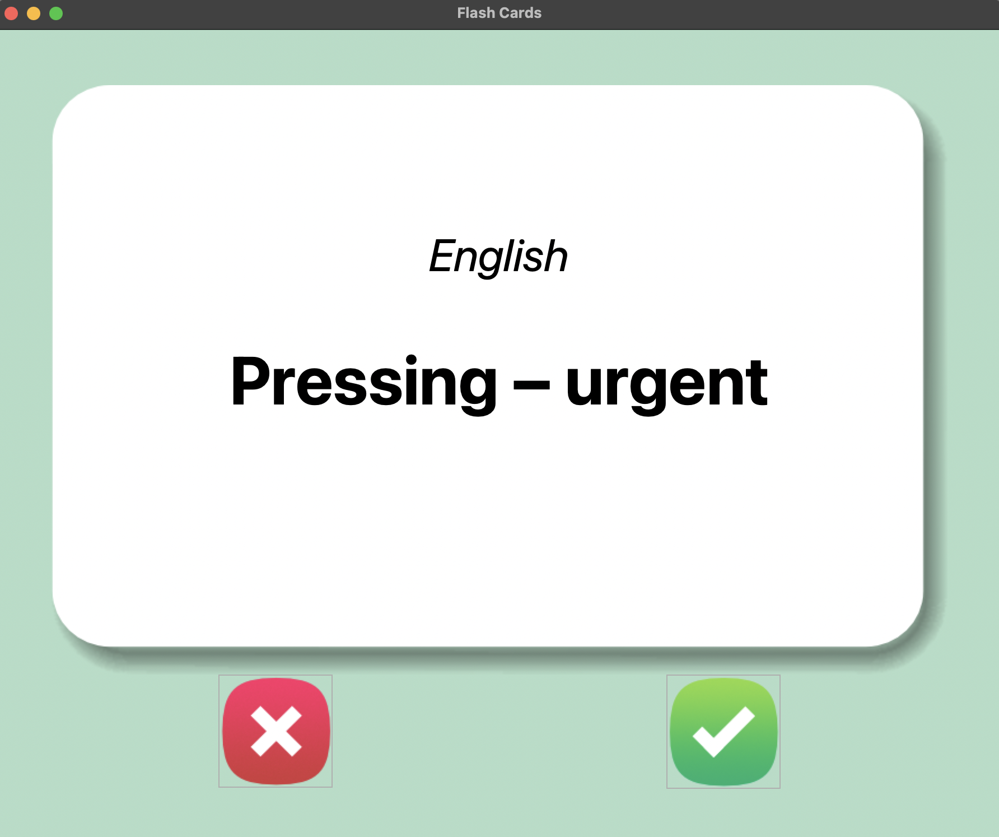
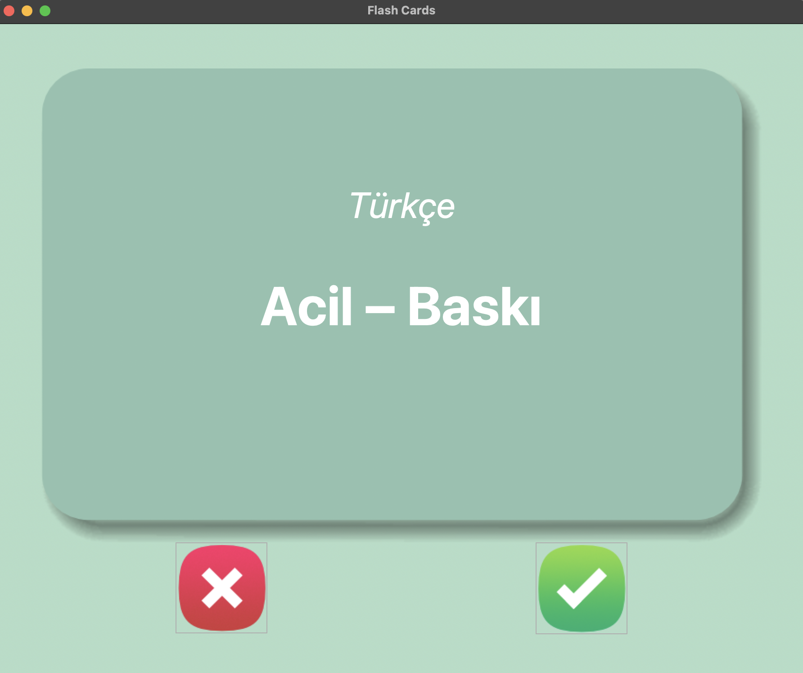

# FlashCard Uygulaması

Bu uygulama, İngilizce-Türkçe kelime kartlarıyla kelime ezberlemenizi kolaylaştırır.  
Tkinter ile yapılmıştır ve 4 saniyede bir kart otomatik döner.

## Özellikler
- İngilizce kelimeyi gösterir
- 4 saniye sonra Türkçe çevirisini gösterir
- Doğru / yanlış butonları ile kart geçişi

